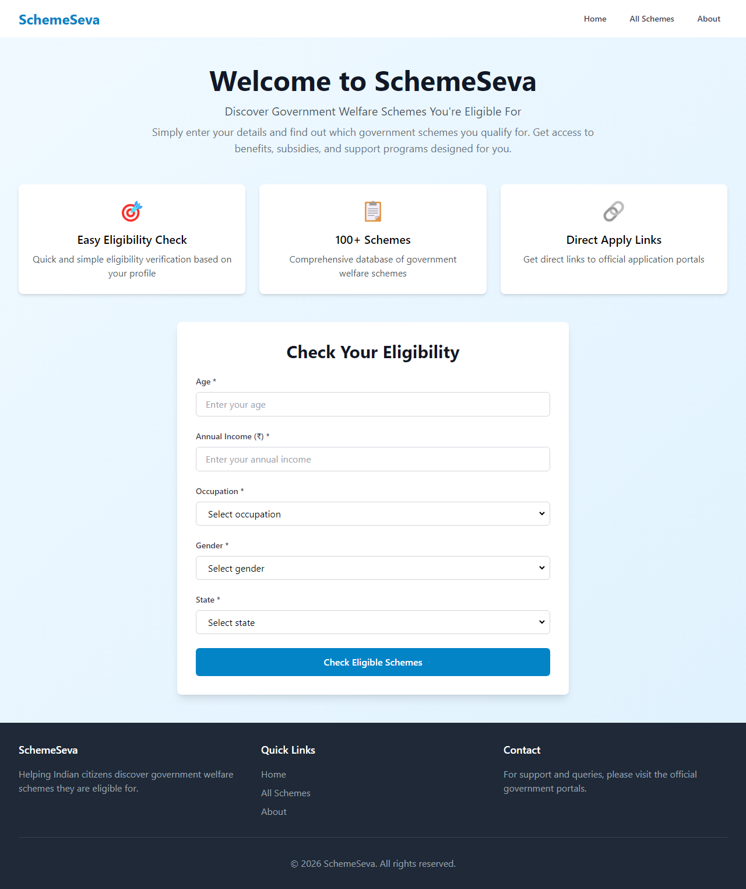
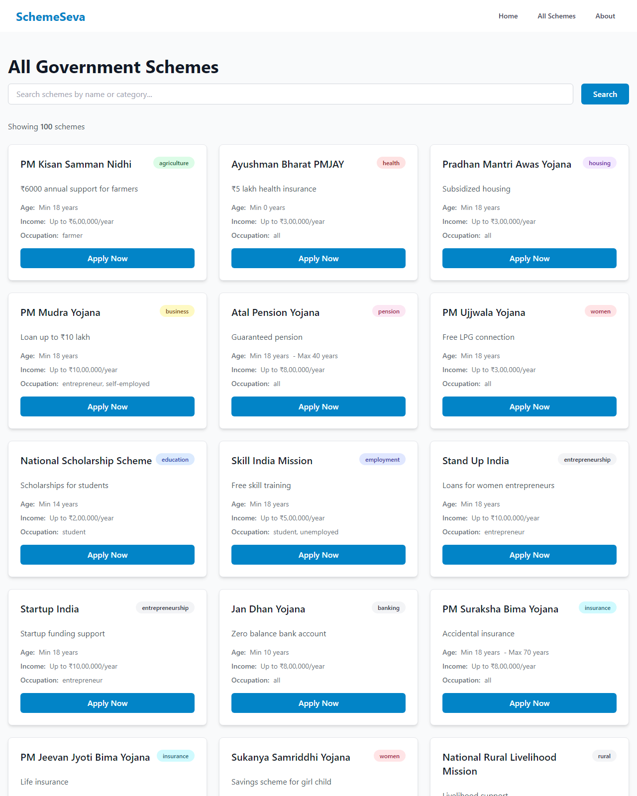
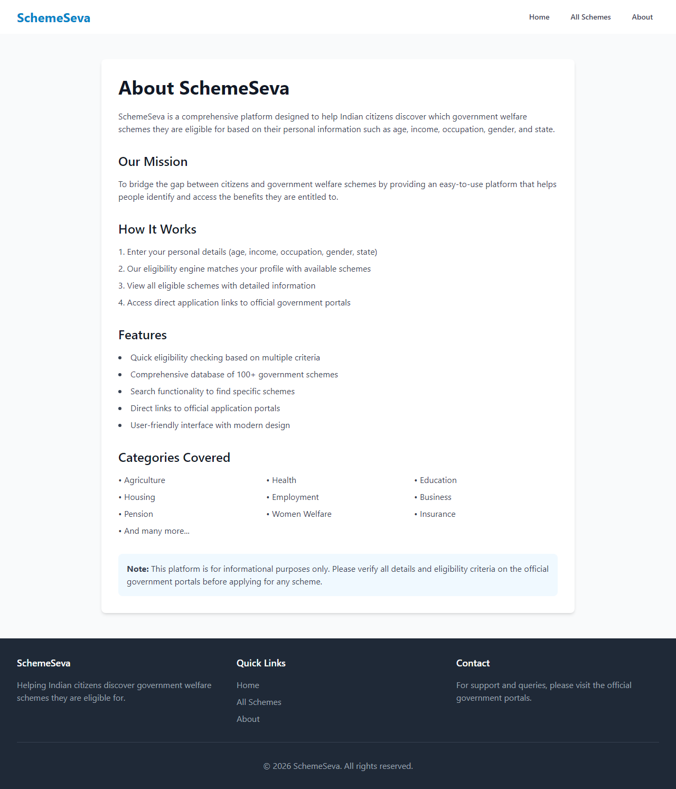
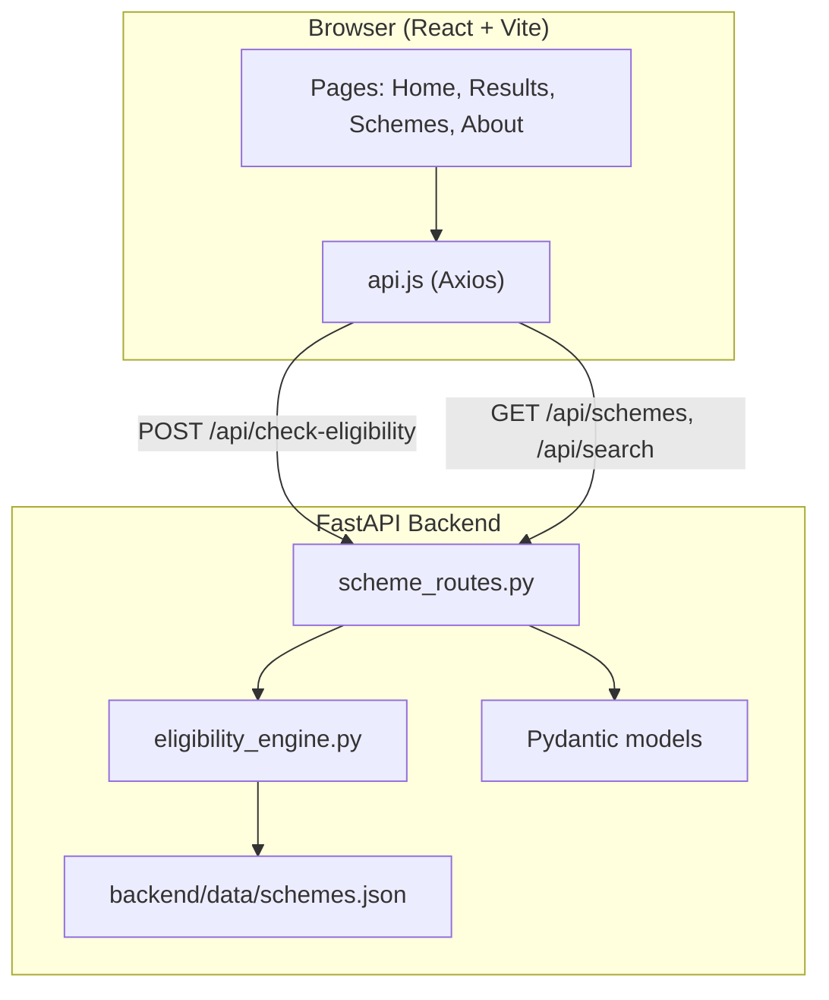

# SchemeSeva

**A full-stack government welfare scheme eligibility platform for Indian citizens.**

[](https://scheme-seeva.onrender.com)

**Live app:** [https://scheme-seeva.onrender.com](https://scheme-seeva.onrender.com)

SchemeSeva helps users discover which central and state government schemes they may qualify for—based on age, income, occupation, gender, and state—and routes them to official application portals. The project demonstrates end-to-end product thinking: a rule-based matching engine, a REST API with validation, and a responsive React frontend.

---

## Preview

### Home — eligibility checker



### All schemes catalog



### About



---

## Table of Contents

- [Preview](#preview)
- [Problem & Solution](#problem--solution)
- [Key Features](#key-features)
- [Tech Stack](#tech-stack)
- [Architecture](#architecture)
- [How Eligibility Matching Works](#how-eligibility-matching-works)
- [Project Structure](#project-structure)
- [Getting Started](#getting-started)
- [API Reference](#api-reference)
- [Production Deployment](#production-deployment)
- [Skills Demonstrated](#skills-demonstrated)
- [Future Enhancements](#future-enhancements)
- [Disclaimer](#disclaimer)
- [License](#license)

---

## Problem & Solution

India runs hundreds of welfare schemes across agriculture, education, health, employment, and social security. Citizens often do not know which programs apply to them, and official portals are fragmented.

**SchemeSeva** addresses this by:

1. Collecting a short user profile (no login required for the demo flow).
2. Running deterministic eligibility rules against a curated dataset of **100 schemes**.
3. Returning matched schemes with benefits and **official apply links**.

This is built as a portfolio-grade full-stack application—not a static brochure site—with a clear separation between UI, API, and business logic.

---

## Key Features

| Feature | Description |
|--------|-------------|
| **Eligibility checker** | Instant matching from age, annual income, occupation, gender, and state |
| **Scheme catalog** | Browse all 100 schemes with category and benefit details |
| **Search** | Filter schemes by name or category via the API |
| **Official apply links** | Each scheme card links to the real government portal |
| **Responsive UI** | Mobile-friendly layout with Tailwind CSS |
| **Interactive API docs** | Auto-generated OpenAPI/Swagger at `/docs` |
| **Health endpoint** | `/health` reports API status and loaded scheme count |
| **Single-service deploy** | FastAPI can serve the production React build from one server (e.g. Render) |

---

## Tech Stack

### Frontend
| Technology | Role |
|------------|------|
| **React 18** | Component-based UI and client-side routing |
| **Vite** | Fast dev server and optimized production builds |
| **Tailwind CSS** | Utility-first styling and responsive design |
| **React Router** | Multi-page navigation (Home, Results, Schemes, About) |
| **Axios** | Typed HTTP client with structured error handling |

### Backend
| Technology | Role |
|------------|------|
| **Python 3.8+** | Application runtime |
| **FastAPI** | High-performance async API framework |
| **Pydantic v2** | Request/response validation and OpenAPI schemas |
| **Uvicorn** | ASGI server for local and production |
| **JSON data store** | `schemes.json`—easy to extend without a database for this scope |

---

## Architecture



**Design choices worth noting:**

- **Layered backend**: routes → services → data, keeping matching logic testable and separate from HTTP concerns.
- **CORS configured** for local Vite dev (including dynamic localhost ports).
- **Optional monolith mode**: built frontend assets under `backend/build/` are served by FastAPI for one-click cloud deployment.

---

## How Eligibility Matching Works

The engine in `backend/app/services/eligibility_engine.py` evaluates each scheme with explicit, readable rules:

1. **Age** — user age must be ≥ `min_age` and ≤ `max_age` (when defined).
2. **Income** — user annual income must be ≤ `max_income`.
3. **Occupation** — user occupation must match scheme list, or scheme allows `"all"`.
4. **Gender** — exact match or scheme allows `"all"`.
5. **State** — exact match or scheme allows `"all"`.

Only schemes passing all checks are returned. Results are validated through Pydantic `Scheme` and `EligibilityResponse` models before reaching the client.

---

## Project Structure

```
SchemaSeva/
├── backend/
│   ├── app/
│   │   ├── main.py                 # FastAPI app, CORS, static frontend serving
│   │   ├── requirements.txt        # Python dependencies
│   │   ├── routes/
│   │   │   └── scheme_routes.py    # REST endpoints
│   │   ├── services/
│   │   │   └── eligibility_engine.py
│   │   └── models/
│   │       └── user_model.py       # Pydantic request/response models
│   ├── data/
│   │   └── schemes.json            # 100 government schemes
│   └── build/                      # Production React build (for single deploy)
├── frontend/
│   ├── src/
│   │   ├── components/             # Navbar, Footer, EligibilityForm, SchemeCard, Loader
│   │   ├── pages/                  # Home, Results, Schemes, About
│   │   ├── services/
│   │   │   └── api.js              # API client (localhost:8000)
│   │   ├── App.jsx
│   │   └── main.jsx
│   ├── package.json
│   └── vite.config.js
└── README.md
```

---

## Getting Started

### Prerequisites

- **Python 3.8+**
- **Node.js 16+** and npm

### 1. Clone the repository

```bash
git clone https://github.com/<your-username>/SchemaSeva.git
cd SchemaSeva
```

### 2. Backend (API)

```bash
cd backend
python -m venv venv
```

**Activate the virtual environment:**

| OS | Command |
|----|---------|
| Windows (PowerShell) | `.\venv\Scripts\activate` |
| macOS / Linux | `source venv/bin/activate` |

```bash
pip install -r app/requirements.txt
uvicorn app.main:app --reload
```

- API base: **http://localhost:8000**
- Swagger UI: **http://localhost:8000/docs**
- Health check: **http://localhost:8000/health**

### 3. Frontend (UI)

Open a **second terminal**:

```bash
cd frontend
npm install
npm run dev
```

- App: **http://localhost:5173**

The frontend expects the API at `http://localhost:8000/api` (see `frontend/src/services/api.js`). Keep both processes running during development.

### Quick test flow

1. Open **http://localhost:5173**
2. Enter sample details (e.g. age `25`, income `200000`, occupation `student`, gender `male`, state `Maharashtra`)
3. Submit **Check Eligible Schemes** and review results on the Results page
4. Browse **All Schemes** or use search

---

## API Reference

### `POST /api/check-eligibility`

Check which schemes match the user profile.

**Request body:**

```json
{
  "age": 25,
  "income": 200000,
  "occupation": "student",
  "gender": "male",
  "state": "Maharashtra"
}
```

**Response:**

```json
{
  "eligible_schemes": [ /* array of Scheme objects */ ],
  "total_count": 10
}
```

### `GET /api/schemes`

Returns all schemes in the database.

### `GET /api/search?query={text}`

Search schemes by name or category (case-insensitive).

### `GET /health`

Returns service health and number of schemes loaded.

---

## Production Deployment

This repo supports **single-service deployment** (e.g. on Render):

1. Build the frontend: `cd frontend && npm run build`
2. Copy the build output into `backend/build/`
3. Run: `uvicorn app.main:app --host 0.0.0.0 --port $PORT` from the `backend` directory

FastAPI serves the React app at `/` and API routes under `/api`. The production build is tracked in git (see `.gitignore` exceptions for `backend/build/`).

**Live deployment (Render):** [https://scheme-seeva.onrender.com](https://scheme-seeva.onrender.com)

---

## Skills Demonstrated

This project is intended to showcase skills relevant to **full-stack / backend / frontend** roles:

- **REST API design** with FastAPI, status codes, and OpenAPI documentation
- **Data validation** using Pydantic models and field constraints
- **Business logic isolation** in a dedicated eligibility service
- **Modern React** patterns: routing, reusable components, async data fetching
- **Developer experience**: hot reload (Vite + Uvicorn), clear folder structure
- **Deployment awareness**: CORS, static file serving, health checks, bundled frontend for PaaS
- **Real-world domain modeling** for civic-tech / gov-tech use cases

---

## Future Enhancements

- User accounts and saved eligibility history
- PostgreSQL or MongoDB instead of static JSON for dynamic updates
- Admin panel to add/edit schemes without code changes
- Multilingual UI (Hindi + English)
- SMS/email reminders for application deadlines
- Unit and integration tests (pytest + React Testing Library)

---

## Disclaimer

SchemeSeva is an **informational** tool for learning and portfolio purposes. Eligibility rules are simplified; official government portals remain the source of truth. Always verify criteria and documents before applying.

---

## License

This project is open source under the **MIT License**.

---

## Author

**Thanmaya Sree Bommareddy**

- **Live demo:** [https://scheme-seeva.onrender.com](https://scheme-seeva.onrender.com)
- **GitHub:** [github.com/bommareddythanmayasree](https://github.com/bommareddythanmayasree)
- **LinkedIn:** [thanmaya-sree-bommareddy](https://www.linkedin.com/in/thanmaya-sree-bommareddy-947a96308/)

If you found this useful, consider starring the repository.
